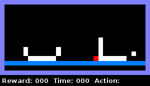

PixelWorld
----------

An interconnected suite of conceptual learning and benchmark environments, drawn
from a common distribution. Environments are compatible with 
[OpenAI gym](https://github.com/openai/gym) and [RLLab](https://github.com/rll/rllab).

This repository contains code sufficient to generate the datasets and 
experimental setup used in our AAAI 2018 paper, but is not sufficient to
reproduce the experimental results (see `Repository vs. paper code` section
below).

See:
> Hay N, Stark M, Schlegel A, Wendelken C, Park D, Purdy E, Silver T, Phoenix DS, George D (2018) Behavior is Everything – Towards Representing Concepts with Sensorimotor Contingencies. In *Proceedings of the Thirty-Second AAAI Conference on Artificial Intelligence*, New Orleans, Louisiana.
([PDF](https://www.vicarious.com/papers/AAAI18-pixelworld), 
 [Supplemental information](documentation/paper/AAAI18-pixelworld-supplemental.pdf))

  
*(animation of Fig. 1b from the paper)*


-----

Setup
-----

1. Create and activate the virtual environment:
    
    ```
    make venv
    source venv/bin/activate
    ```

2. Make sure you have `ffmpeg` installed if you plan to run the full experiment
    pipeline via `run.py` (see `Demo` below). On Ubuntu:
    ```
    sudo apt install ffmpeg
    ```
    or on Mac:
    ```
    brew install ffmpeg
    ```


Demo
----

1. Test pixelworld in interactive mode. This demo provides samples of the
    classification environments used in the actual experiment, in which the
    agent is embodied as a red pixel that moves using the "UP", "DOWN", "LEFT",
    and "RIGHT" actions. The agent must investigate the environment in order to
    determine which of two classes is represented (for instance, whether a
    container or a non-container is present), and then terminate the episode
    with a signal action ("SIG0" or "SIG1") to indicate its choice. Note that,
    while the entire environment is visible in interactive mode (on the left),
    the actual experiments provided only a 3 x 3 window around the agent as its
    observation (on the right).
    ```
    python pixelworld/demo.py demo=interactive
    ```

2. Run the experiment to train and test agents in a pixelworld environment, using
RLLab for reinforcement learning. You
    can use either the example code:
    ```
    python pixelworld/demo.py demo=experiment
    ```
    or our more general experimentation framework (see `Repository vs. paper code`
    section below):
    ```
    python pixelworld/run.py experiments/demo
    ```
    If you run with the general framework, output from the experiments can be
    found within `out/demo/` (see `Experiment output` section below).
    Note that this is meant only to illustrate how to use PixelWorld environments for
    RL. The experimental setup is not tuned for performance. 

3. Interact with and run an experiment with a custom dataset:
    ```
    python pixelworld/demo.py demo=custom_interactive
    python pixelworld/demo.py demo=custom_experiment
    ```
    Try modifying `custom_concept`, `custom_generators`, and `custom_macros` in
    `pixelworld/demo.py`.

4. Explore other environments from the library. While the environments presented
    in the paper used a minimal subset of pixelworld's available features
    (see `Code organization` section below), an
    extended library of example worlds exists that demonstrates the rich
    potential of pixelworld to generate concept-based reinforcement learning
    environments. NOTE that these environments are still in a beta stage and are
    not supported:
    ```
    python pixelworld/envs/pixelworld/demo.py boxandblocks
    python pixelworld/envs/pixelworld/demo.py pixelpack
    python pixelworld/envs/pixelworld/demo.py help_or_hinder stage=1
    python pixelworld/envs/pixelworld/demo.py pixelzuma
    python pixelworld/envs/pixelworld/demo.py hanoi
    ```
    To list all available library worlds:
    ```
    from pixelworld.envs.pixelworld import library
    print library.menu()
    ```


Experiment output
-----------------

When running experiments by invoking:
```
    python pixelworld/run.py experiments/<filepath>
```
output files are written for each experiment into `out/<filepath>/<experiment>/`, 
including:
* `gym_train/*.mp4` and `gym_test/*.mp4`: videos recorded while training and
testing, respectively,
* `itr_<num>.pkl`: a `joblib`-encoded dictionary containing the RLLab algorithm,
    baseline, environment, and policy for iteration `<num>`,
* `test_results.pkl`: a `joblib`-encoded dictionary containing:
    * `gt_labels`: the ground truth labels for each of the test environments,
    * `steps`: the total number of timesteps the policy took for each repeat of each test environment,
    * `final_rewards`: the reward of the final step for each repeat of each test
        environment, and
    * `correct_class`: whether the policy made the correct classification for 
    each repeat of each test environment,
* `traj_instance_<num>.pkl`: a `joblib`-encoded dictionary including information
    about the results of the `<num>`th test environment:
    * `avg_image`: average over repeats, maximum over timesteps, of a visualization
        of the environment state,
    * `actions`: list for each repeat of a one-hot encoding of the action taken
        in each timestep,
    * `prob`: list for each repeat of the probability vector over actions
        in each timestep,
* `rllab.txt`, `rllab.csv`: output from rllab during training, both as written
    to standard output and encoded in csv format.

For further details of this output, see the functions `test_policy_record` and 
`execute_experiment_iteration` in `run_policy.py`.


Code organization
-----------------

Some notes on code organization:

* `run.py` is the main script for running experiments specified by metaexperiment
files. It calls functions in `run_policy.py` to perform the experiment, and 
functions in `expcfg.py` to interpret the metaexperiment file.

* `generate_dataset` in `concept_csp.py` is called to generate datasets from 
logical expressions for the concept and generating expressions. It uses the
function `concept_to_csps` to convert logical expressions into Constraint
Satisfaction Problems (CSPs), which
itself calls code in `concept_parser.py` to parse the logical expression and
code in `csp.py` to implement constraints in the CSP. `generate_patterns`
in `pattern_generator.py` generates patterns for different object types (e.g.,
containers) and `generate_annotations` in `scene_annotation.py` annotates those
patterns with information needed to compute relations (e.g., annotating the
inside of a container).

* `envs/pixelworld/` contains code for the full implementation of pixelworld,
and `envs/minimal_pixelworld.py` for the more computatioanlly efficient minimal
implementation used in the AAAI18 experiments.

* `envs/modular_env.py` and `envs/modules.py` contain code for the construction of
modular environments, in which an environment is composed of multiple modules.
For example, a modular environment might consist of a module that interfaces with 
pixelworld, a module that implements a classification reward, a module that 
implements signaling, and a module that implements the local observation window.


Repository vs. paper code
-------------------------

The code in this repository is a reorganized version of that which was used in
the experiments presented in our paper.  Two changes in particular are worth
noting:

1. The code contains only what is needed to train the flat *smc-base* policies.

2. After the paper's acceptance, we discovered a bug in our "MinimalPixelWorld"
    implementation that caused the self object to occupy both its previous and
    its new state locations for one step after an environment reset. We do not
    believe that this affected our results in any meaningful way, since it
    occurred uniformly across all conditions and training and testing datasets,
    the issue rarely appeared to the agent because of its limited view of the
    environment, and our own testing indicated that it had minimal, if any,
    effect on agent performance. The bug is fixed in this repository. However,
    the original implementation can be used by setting the
    `do_aaai18_reset_behavior` parameter of the MinimalPixelWorldModule to
    `True`, e.g. by adding it as an additional kwarg in the
    `/experiments/aaai18/COMMON` metaexperiment configuration file.

